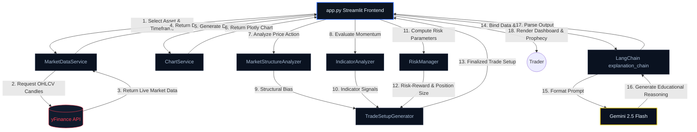

# Prophet.ai

## Ready to Consult the Oracle?

<p align="center">
  
</p>

**Prophet** is an AI-powered trading mentor that analyzes market structure, interprets technical indicators, evaluates risk, and explains its reasoning in simple language. Built to educate rather than predict, it helps beginner traders understand the **why** behind every trading setup.

**Live Demo:** [prophet-ai.streamlit.app](https://prophet-ai.streamlit.app)
---

## The Tech Stack

Behind the crystal ball is a modern, robust, and highly reliable Python stack. Let’s break down the key ingredients:

*   **Python (v3.10+)**: The bedrock of our calculations, data wrangling, and AI orchestrations.
*   **Streamlit**: For rendering the beautiful terminal interface. It turns data scripts into interactive web apps in minutes. *It also has a mind of its own, hence the occasional required restart.*
*   **LangChain**: The neural routing system that structures our prompts and coordinates conversations with our Large Language Model.
*   **Gemini 2.5 Flash (via langchain-google-genai)**: The "brain" of the Prophet. A lightning-fast, high-context AI model that acts as our trading mentor, digesting numbers and converting them into human-readable warnings and setups.
*   **yFinance**: The direct pipeline to Yahoo Finance, pulling live ticker metadata and historical market candles (OHLCV) on demand.
*   **Pandas**: The ultimate spreadsheet simulator in Python, utilized for parsing and processing raw candle data, lows, highs, and indicators.
*   **Plotly**: The interactive graphing engine that feeds our users with high-fidelity, responsive candlestick and volume charts.

---

## Folder Structure

Here is how the temple is organized:

```text
prophet_ai/
├── assets/                     # UI visual assets
│   └── images/
│       └── prophet.png         # The face of the Oracle
├── chains/                     # LangChain logical pathways
│   └── explanation_chain.py    # Chains the Prompt -> LLM -> Output Parser
├── services/                   # Heavy-lifting business logic
│   ├── chart_services.py       # Visualizes price & volume with Plotly
│   ├── indicators.py           # Deciphers RSI & volume cues
│   ├── market_data.py          # Interfaces with yFinance API
│   ├── market_structure.py     # Detects trends, ranges, and breakouts
│   ├── risk_manager.py         # Position sizing & Risk-Reward calculations
│   └── trade_setup.py          # Assembles all indicators into Long/Short/Wait setups
├── utils/                      # Helper modules and constants
│   └── prompts.py              # The instructions/prompts for the AI Mentor
├── app.py                      # Main entry point & Streamlit frontend
├── guide.md                    # In-depth reference on trading terminology
├── market_structures.md        # Reference manual for structure patterns
└── requirements.txt            # System dependencies
```

---

## System Architecture

Below is a component flow diagram visualizing how user input moves from the frontend to our analytical engines, then pipes into Gemini to generate the final educational prophecy:



---

## Demystifying Market Structure

In the trading world, the market never walks in a straight line; it dances. Market structure is how we map that dance. Prophet categorizes price movements into distinct states, helping you avoid trading against the tide.

### 1. Bullish vs. Bearish Trends
Markets trend by making series of peaks and troughs. 
*   **Bullish Trend**: Price forms Higher Highs (HH) and Higher Lows (HL). Buyers are stepping in at progressively higher price levels.
*   **Bearish Trend**: Price forms Lower Highs (LH) and Lower Lows (LL). Sellers are overwhelming buyers, forcing prices down.

### 2. Breakouts vs. Breakdowns
*   **Bullish Breakout**: Price surges past a major resistance level. If accompanied by high volume, it signals buyers are charging ahead.
*   **Bearish Breakdown**: Price falls below support. High volume confirms sellers are jumping ship, accelerating the drop.

### 3. Ranges & Consolidation (The Slumber)
*   **Consolidation**: The market takes a breath. Buyers and sellers are in a temporary deadlock, compressing the price range to under 2% of the asset's value. 
*   **Range Bound**: The price bounces around like a pinball between support and resistance, going nowhere fast.

---

## Code Deep Dive & Core Functions

Here is the secret math under the Prophet’s hood. We split complex evaluations into dedicated micro-services for modularity and mathematical clarity.

### 1. Market Structure Detection
In [market_structure.py](file:///d:/Placement%20Prep/GEN%20AI/projects/prophet_ai/services/market_structure.py), the [MarketStructureAnalyzer.analyze](file:///d:/Placement%20Prep/GEN%20AI/projects/prophet_ai/services/market_structure.py#L6-L142) function extracts peaks and troughs from historical prices:
```python
# Find local highs and lows
for i in range(1, len(prices) - 1):
    if prices[i] > prices[i - 1] and prices[i] > prices[i + 1]:
        highs.append(prices[i])

    if prices[i] < prices[i - 1] and prices[i] < prices[i + 1]:
        lows.append(prices[i])
```
If we have at least two local highs and lows, we compare the latest entries:
*   `last_high > previous_high and last_low > previous_low` $\rightarrow$ **Bullish Trend**
*   `last_high < previous_high and last_low < previous_low` $\rightarrow$ **Bearish Trend**
*   If current price breaks past support or resistance on **Increasing Volume**, it signals a **Breakout / Breakdown**.
*   If the price range is within $2\%$ of the price, it signals **Consolidation**.

### 2. Momentum & Volume Translation
In [indicators.py](file:///d:/Placement%20Prep/GEN%20AI/projects/prophet_ai/services/indicators.py), the [IndicatorAnalyzer.analyze](file:///d:/Placement%20Prep/GEN%20AI/projects/prophet_ai/services/indicators.py#L5-L125) function converts raw indicators into qualitative biases:
*   **RSI (Relative Strength Index)**: Translates momentum. If $\ge 70$, momentum is overbought (warning of pullbacks). If $\le 30$, it is oversold (expecting bounces).
*   **Volume**: Translates conviction. Increasing volume confirms momentum; decreasing volume flags a dying move.
*   **Moving Averages (SMA 20 vs 50)**: Standard trend crossovers. Price above both moving averages is a strong confirmation of bullish bias.

### 3. Capital Protection Math
A trading system is only as good as its risk management. In [risk_manager.py](file:///d:/Placement%20Prep/GEN%20AI/projects/prophet_ai/services/risk_manager.py), the [RiskManager.analyze](file:///d:/Placement%20Prep/GEN%20AI/projects/prophet_ai/services/risk_manager.py#L14-L98) function manages your cash:
*   **Risk Amount**: Calculates maximum absolute loss based on capital:
    $$\text{Risk Amount} = \text{Capital} \times \left( \frac{\text{Risk Percent}}{100} \right)$$
*   **Position Sizing**: Computes exactly how many units you can buy without breaking your rule:
    $$\text{Position Size} = \left\lfloor \frac{\text{Risk Amount}}{|\text{Entry} - \text{Stop Loss}|} \right\rfloor$$
*   **Risk-to-Reward Ratio**:
    $$\text{R:R Ratio} = \frac{|\text{Target} - \text{Entry}|}{|\text{Entry} - \text{Stop Loss}|}$$
    If R:R is $\ge 3$, it's graded **Excellent**; if $\ge 2$, it's **Good**; less than $1$ is **Poor** (and should be avoided!).

### 4. Trade Scenario Assembler
In [trade_setup.py](file:///d:/Placement%20Prep/GEN%20AI/projects/prophet_ai/services/trade_setup.py), the [TradeSetupGenerator.generate](file:///d:/Placement%20Prep/GEN%20AI/projects/prophet_ai/services/trade_setup.py#L12-L136) function acts as the strategist:
*   **Long Scenario**: Triggered if market structure is bullish and overall indicator bias is bullish. Entry is set at resistance, stop loss at support, and take profit target at entry + $2 \times$ risk.
*   **Short Scenario**: Triggered if structure is bearish and bias is bearish. Entry is set at support, stop loss at resistance, and target at entry - $2 \times$ risk.
*   **Wait Scenario**: Triggered in range-bound/consolidating markets, adding warnings that breakout confirmation is needed.

### 5. Binding the AI Mentor
In [explanation_chain.py](file:///d:/Placement%20Prep/GEN%20AI/projects/prophet_ai/chains/explanation_chain.py), we create the [explanation_chain](file:///d:/Placement%20Prep/GEN%20AI/projects/prophet_ai/chains/explanation_chain.py#L34-L38) pipeline utilizing LangChain Expression Language (LCEL):
```python
explanation_chain = (
    prompt
    | llm
    | parser
)
```
This feeds our computed statistics and warnings into the `EXPLANATION_TEMPLATE` (defined in [prompts.py](file:///d:/Placement%20Prep/GEN%20AI/projects/prophet_ai/utils/prompts.py#L1-L66)), commanding Gemini 2.5 Flash to generate a beautifully structured, beginner-friendly educational breakdown containing a Market Overview, Indicator Analysis, Trade Setup explanation, Risks assessment, and a custom Learning Note.

---

## Getting Started

To set up Prophet's temple on your local machine, follow these steps:

### Prerequisite
Make sure you have an API key from Google AI Studio. Set up a `.env` file in the root directory:
```env
GEMINI_API_KEY="your_api_key_here"
```

### Installation
1.  **Clone the repository**:
    ```bash
    git clone https://github.com/your-username/prophet_ai.git
    cd prophet_ai
    ```
2.  **Create and activate a virtual environment**:
    ```bash
    python -m venv venv
    # Windows
    venv\Scripts\activate
    # macOS/Linux
    source venv/bin/activate
    ```
3.  **Install dependencies**:
    ```bash
    pip install -r requirements.txt
    ```
4.  **Launch the Streamlit app**:
    ```bash
    streamlit run app.py
    ```

---

## Conclusion

Prophet combines technical indicators with AI-generated explanations to make market analysis more accessible, interpretable, and engaging. While it can highlight patterns, summarize signals, and explain the reasoning behind common trading indicators, the final investment decision should always remain with the user.

Like every good forecasting model, Prophet embraces uncertainty. It can estimate market trends, but it still cannot explain why restarting Streamlit sometimes fixes everything.
